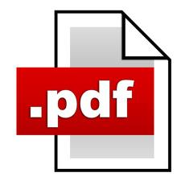

# Hosting website in github
test
# Markdown 
===
Text with '=' beneath
===

2 or more space at end of line = Line fee  
next line (line2)  
next line (line3) 

text enclosed with asterisk is *italic*  
text enclosed with 2-asterisk is **BOLD**  
text enclosed with 3-asterisk is ***Strong or Italic+BOLD***  
text enclosed with 4-asterisk is ****Strong or Italic+BOLD****

> a \> in front of a paragraph for block quote.
Paragraphs are the building blocks of papers. Many students define paragraphs in terms of length: a paragraph is a group of at least five sentences, a paragraph is half a page long, etc.
>>Blockquotes can be nested. Add a \>\> in front of the paragraph you want to nest.
**note that backslah ('\\') is used here to **escape** special characters

1. To create an ordered list, start the firstline with 1.
9. second item
     1. sublist item 1 (sublist is indented with spaces
     1. sublist item 2
5. add line items with 1.

- unordered list: starts with (-), asterisks (*), or plus(+) 
- 2nd item  
   -sub list item 1
- 3 item

##Code blocks##
- indented four spaces or one tab (for each line). When they’re in a list, indent them eight spaces or two tabs.  
	
		function test: boolean;  
		var x: string;  
		begin  
		end

 
[Link](image2.jpg) 

three or more star or dash for rules
---
***

##Reference##  
[link1][1] and [link2 ][2]

[1]:http://www.google.com  
[2]:http://github.com

| Month | Savings |
| -------- | :-------------: |
| January | $250 |
| February | $80 |
| March | $420 |
